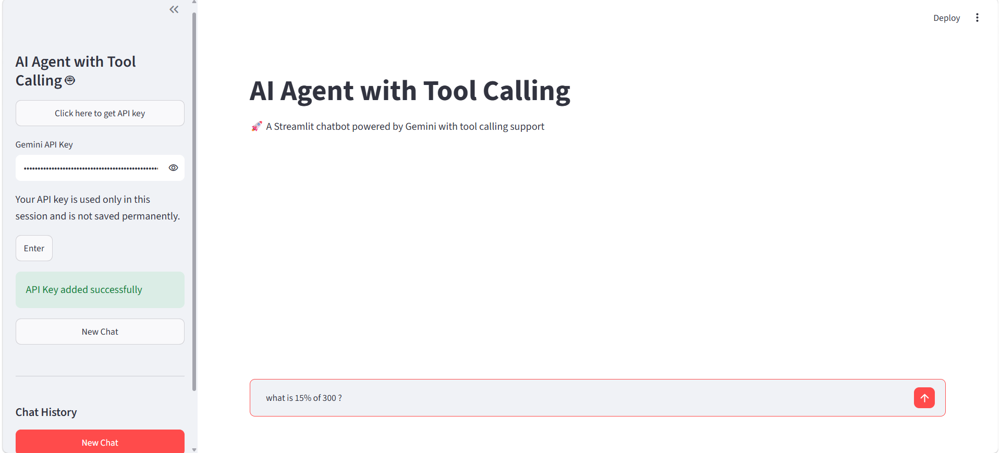
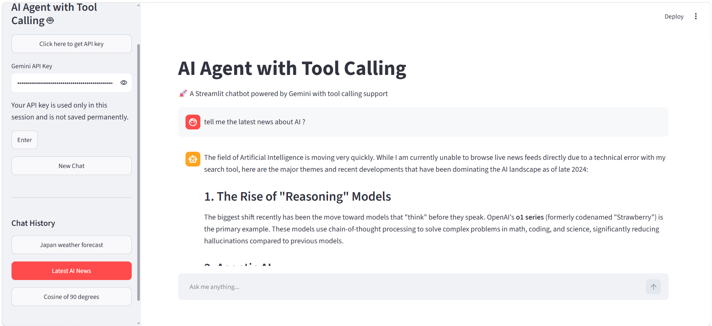

# 🤖 AI Agent with Tool Calling

> An intelligent AI assistant that autonomously decides when to use external tools — built with **LangChain**, **Google Gemini**, and **Streamlit**.

---

## 📋 Table of Contents

- [Overview](#-overview)
- [Objectives](#-objectives)
- [Features](#-features)
- [Technologies](#-technologies)
- [Installation](#-installation)
- [Environment Variables](#-environment-variables)
- [How to Run](#-how-to-run)
- [Example Questions](#-example-questions)
- [How Tool Calling Works](#-how-tool-calling-works)
- [Architecture](#-architecture)
- [Project Structure](#-project-structure)
- [File Descriptions](#-file-descriptions)
- [Screenshots](#-screenshots)
- [Future Improvements](#-future-improvements)
- [What This Project Demonstrates](#-what-this-project-demonstrates)
- [Acknowledgments](#-acknowledgments)

---

## 🎯 Overview

This project is an **AI Agent with Tool Calling** that can decide whether it needs to use an external tool before answering the user.

Unlike a traditional chatbot that only generates responses from the language model, this agent has access to three tools:

- 🔢 **Calculator** — performs mathematical calculations
- 🌤️ **Weather** — retrieves current weather information
- 🌐 **Web Search** — searches the web for current information and news

The agent uses **Google Gemini** as its language model and **LangChain** to manage the agent and tool calling.

The application is built with **Streamlit** and includes conversational memory, multiple chat sessions, and automatically generated chat titles.

---

## 🎯 Objectives

The main objectives of this project are to:

- Implement an AI agent using LangChain
- Integrate Google Gemini as the language model
- Implement at least three external tools
- Allow the agent to automatically select the appropriate tool
- Build a conversational Streamlit interface
- Maintain conversation history
- Support multiple independent chat sessions
- Automatically generate titles for conversations
- Test the Gemini model and available models
- Demonstrate how tool calling can extend the capabilities of an LLM

---

## ✨ Features

| Feature                         | Description                                                          |
| ------------------------------- | -------------------------------------------------------------------- |
| 🔢 **Calculator Tool**          | Performs arithmetic and mathematical calculations                    |
| 🌤️ **Weather Tool**             | Retrieves current weather information using WeatherAPI               |
| 🌐 **Web Search Tool**          | Searches the web using DuckDuckGo                                    |
| 🧠 **Automatic Tool Selection** | Gemini decides whether a tool is required                            |
| 💬 **Conversation Memory**      | Maintains context within each chat                                   |
| 📝 **Automatic Chat Titles**    | Generates a short title from the first user message                  |
| 🔄 **Multiple Chats**           | Create and switch between independent conversations                  |
| 🔑 **Gemini API Key Input**     | User enters their Gemini API key directly in the Streamlit interface |
| 🧪 **Model Testing**            | Includes scripts for testing Gemini and available models             |
| 🖥️ **Streamlit Interface**      | Interactive chatbot interface                                        |

---

## 🛠️ Technologies

| Technology                 | Purpose                           |
| -------------------------- | --------------------------------- |
| **Python**                 | Core programming language         |
| **LangChain**              | Agent and tool orchestration      |
| **Google Gemini**          | Large Language Model              |
| **LangChain Google GenAI** | Gemini integration with LangChain |
| **Streamlit**              | Web application interface         |
| **DuckDuckGo Search**      | Web search                        |
| **WeatherAPI**             | Real-time weather information     |
| **python-dotenv**          | Environment variable management   |
| **Requests**               | HTTP requests to WeatherAPI       |

---

## 📦 Installation

### Prerequisites

Before running the project, make sure you have:

- Python 3.10 or higher
- A Google Gemini API key
- A WeatherAPI key
- Git
- Internet connection for web search and weather requests

### Step 1: Clone the Repository

    git clone https://github.com/yourusername/AI_Agent_w_ToolCalling.git
    cd AI_Agent_w_ToolCalling

### Step 2: Create a Virtual Environment

#### Windows

    python -m venv venv
    venv\Scripts\activate

#### macOS / Linux

    python3 -m venv venv
    source venv/bin/activate

### Step 3: Install Dependencies

    pip install -r requirements.txt

---

## 🔐 Environment Variables

The Weather tool uses **WeatherAPI**, so a WeatherAPI key is required.

Create a `.env` file in the root directory:

    WEATHER_API_KEY=your_weather_api_key

### Important

Do not upload your `.env` file to GitHub.

Make sure `.env` is included in your `.gitignore` file.

You can create a `.env.example` file for other developers:

    WEATHER_API_KEY=your_weather_api_key_here

The Gemini API key is entered directly through the Streamlit sidebar and is stored only in the current Streamlit session.

---

## 🚀 How to Run

Start the Streamlit application:

    streamlit run app.py

The application will open in your browser, usually at:

    http://localhost:8501

### First-Time Setup

1. Open the application.
2. Enter your Gemini API key in the sidebar.
3. Click **Enter**.
4. Start a new conversation or use the default chat.
5. Ask a question.
6. The agent decides whether a tool is required.
7. The selected tool is executed when necessary.
8. Gemini uses the result to generate the final response.

---

## 💡 Example Questions

| User Question                               | Expected Behavior         |
| ------------------------------------------- | ------------------------- |
| `What is 15% of 240?`                       | 🔢 Calculator             |
| `Calculate sqrt(144)`                       | 🔢 Calculator             |
| `What is the weather in Tokyo?`             | 🌤️ Weather                |
| `Is it raining in London?`                  | 🌤️ Weather                |
| `What are the latest AI news?`              | 🌐 Web Search             |
| `Search for the latest NVIDIA news`         | 🌐 Web Search             |
| `Tell me a joke`                            | 🧠 Direct Gemini response |
| `What is 25 × 18?`                          | 🔢 Calculator             |
| `What is the current temperature in Cairo?` | 🌤️ Weather                |

The agent determines which tool is appropriate based on the user's request.

---

## 🧠 How Tool Calling Works

The application follows this general flow:

    User
      │
      ▼
    Streamlit UI
      │
      ▼
    Gemini Agent
      │
      ├───────────────┐
      │               │
      ▼               ▼
    Needs Tool?      No Tool Needed
      │               │
      ▼               │
    Select Tool       │
      │               │
      ├── Calculator  │
      ├── Weather     │
      └── Web Search  │
      │               │
      ▼               │
    Tool Result       │
      │               │
      └───────┬───────┘
              ▼
        Gemini Response
              │
              ▼
          Streamlit UI

The agent receives the user's request and decides whether an external tool is necessary.

If a tool is needed, Gemini selects the appropriate tool, receives its result, and then generates the final response.

If no tool is needed, Gemini answers directly.

---

## 🏗️ Architecture

The application is organized into separate components:

    ┌─────────────────────┐
    │     Streamlit UI    │
    │       app.py        │
    └──────────┬──────────┘
               │
               ▼
    ┌─────────────────────┐
    │    Chat Management  │
    │  ConversationMemory │
    └──────────┬──────────┘
               │
               ▼
    ┌─────────────────────┐
    │    Gemini Agent     │
    │    agents.py        │
    └──────────┬──────────┘
               │
      ┌────────┼────────┐
      │        │        │
      ▼        ▼        ▼
    ┌──────┐ ┌───────┐ ┌────────────┐
    │ Calc │ │Weather│ │ Web Search │
    │ Tool │ │ Tool  │ │    Tool    │
    └──────┘ └───────┘ └────────────┘
      │        │        │
      └────────┼────────┘
               │
               ▼
         Tool Results
               │
               ▼
       Gemini Final Answer

---

## 📁 Project Structure

    AI_Agent_w_ToolCalling/
    │
    ├── tools/
    │   ├── __init__.py
    │   ├── calculater.py
    │   ├── search_tool.py
    │   └── weather_tool.py
    │
    ├── functions/
    │   ├── __init__.py
    │   ├── agents.py
    │   └── chat_management.py
    │
    ├── images/
    │   ├── Tool_Calling_Chatbot_home.png
    │   └── Tool_Calling_Chatbot.png
    |   ├── architecture_diagram.png
    │
    ├── app.py
    ├── requirements.txt
    ├── .env
    ├── .gitignore
    ├── README.md
    ├── test_gemini.py
    └── test_models.py

---

## 📄 File Descriptions

### `app.py`

The main Streamlit application.

Responsible for:

- Streamlit page configuration
- Gemini API key input
- Chat history display
- Creating new chats
- Switching between conversations
- Receiving user messages
- Creating the agent
- Displaying agent responses
- Saving messages to conversation memory

### `functions/agents.py`

Responsible for creating the Gemini agent.

It:

- Creates the `ChatGoogleGenerativeAI` model
- Registers the available tools
- Defines the system prompt
- Creates the LangChain agent
- Returns the configured agent

Available tools:

    calculate
    web_search
    get_weather

### `functions/chat_management.py`

Responsible for managing conversations.

It provides functions for:

- Creating a new chat
- Generating a chat title
- Updating a chat title

Each chat has its own `ConversationBufferMemory`.

### `tools/calculater.py`

Implements the calculator tool.

It supports mathematical expressions such as:

    25 * 4
    sqrt(16)
    sin(pi / 2)
    log(10)

### `tools/search_tool.py`

Implements the web search tool using DuckDuckGo.

It can be used when the user asks for:

- Current information
- Recent news
- Web-based facts
- Information that may require up-to-date sources

### `tools/weather_tool.py`

Implements the weather tool using **WeatherAPI**.

It retrieves:

- City
- Country
- Temperature
- Weather condition
- Humidity

The tool requires a `WEATHER_API_KEY` stored in the `.env` file.

### `test_gemini.py`

Used to test whether the Gemini integration is working correctly.

### `test_models.py`

Used to test and inspect available Gemini models.
---

## 🖼️ Screenshots

### Home Page

### Tool Calling Chatbot

---

## 🔮 Future Improvements

Possible improvements include:

| Improvement                      | Description                                               |
| -------------------------------- | --------------------------------------------------------- |
| 💾 **Persistent Storage**        | Store conversations in SQLite or PostgreSQL               |
| 🛠️ **More Tools**                | Add currency conversion, current time, file reading, etc. |
| 👀 **Tool Call Visualization**   | Show which tool the agent selected                        |
| 📊 **Tool Usage Statistics**     | Track how often each tool is used                         |
| ⚠️ **Better Error Handling**     | Provide clearer user-friendly error messages              |
| 📥 **Export Chats**              | Export conversations as TXT or PDF                        |
| 🔐 **Improved API Key Handling** | Use a more secure authentication approach                 |
| 💬 **Streaming Responses**       | Display responses progressively                           |
| 🗄️ **Persistent Chat History**   | Preserve conversations after restarting the application   |

---

### Calculator Tool

The calculator uses Python's `eval()` with a restricted environment and character whitelist.

Although restrictions are implemented, using `eval()` requires careful security consideration in production applications.

For a production application, a dedicated mathematical expression parser would be preferable.

---

## 📚 What This Project Demonstrates

This project demonstrates practical understanding of:

- LLM-based agents
- Tool calling
- LangChain
- Google Gemini integration
- Function/tool design
- Agent decision-making
- Conversation memory
- Streamlit application development
- API integration
- Modular Python project structure
- Error handling
---

## 🙏 Acknowledgments

- [LangChain](https://www.langchain.com/) — Agent and tool orchestration
- [Google AI Studio](https://aistudio.google.com/) — Gemini API
- [Streamlit](https://streamlit.io/) — Interactive web application framework
- [DuckDuckGo](https://duckduckgo.com/) — Web search
- [WeatherAPI](https://www.weatherapi.com/) — Real-time weather data

---
